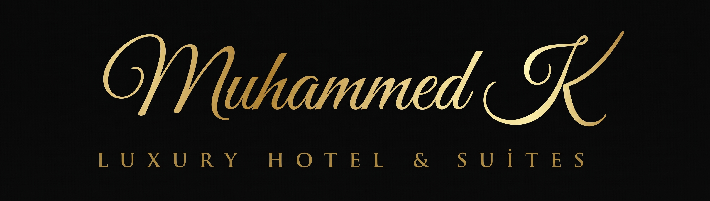
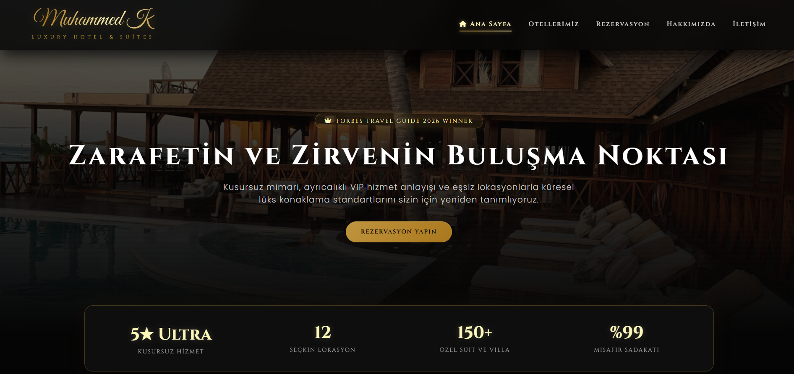
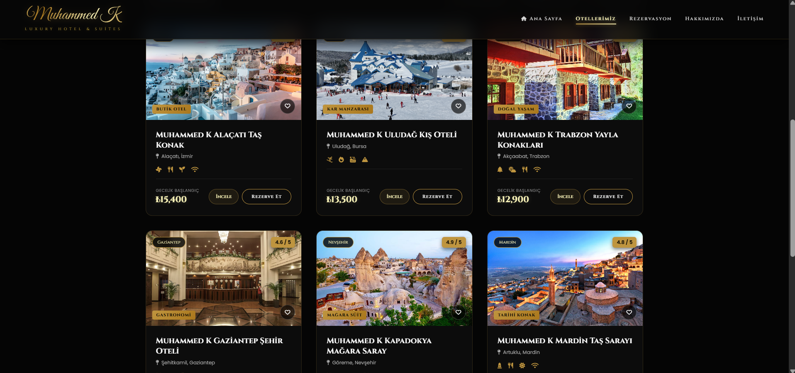
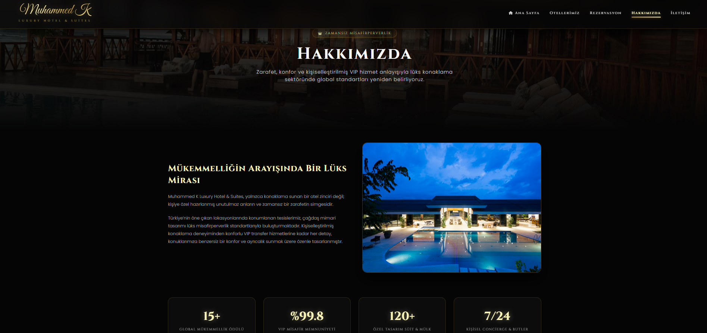
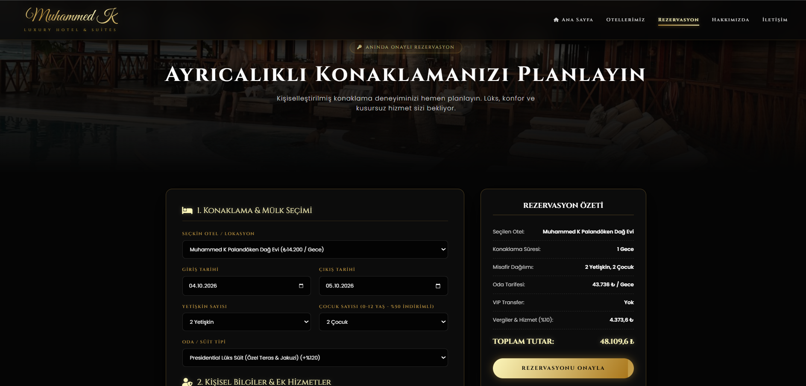
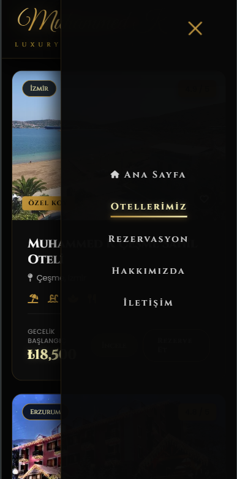
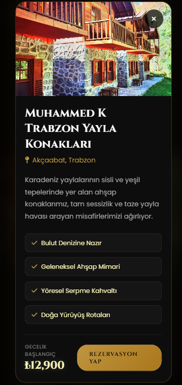

  
  <h1>Muhammed K Luxury Hotel & Suites</h1>
  
<strong>Modern, Modüler ve Mobil Uyumlu Otel & Rezervasyon Yönetim Platformu Konsepti</strong>

  

    
    
    
    
  

 

---

**Muhammed K Luxury Hotel & Suites**, kullanıcıların tesisleri inceleyip filtreleyebileceği, konaklama detaylarına göre anlık fiyat hesaplaması yapabileceği ve favori otellerini kaydedebileceği konsept web tasarım projesidir.

Proje geliştirme sürecinde kullanıcı deneyimi (UX) ön planda tutularak dinamik bir ön yüz yapısı oluşturmaya özen gösterilmiştir.

---

## 📌 Öne Çıkan Özellikler

- 🏨 **Dinamik Otel Listeleme & Filtreleme:** Şehir, konsept, puan ve metin aramasına göre anlık istemci taraflı (client-side) filtreleme.
- ❤️ **Favori Kaydetme:** Beğenilen otellerin tarayıcı hafızasında (`LocalStorage`) saklanması ve favorilere göre filtrelenebilmesi.
- 💰 **Anlık Fiyat Hesaplayıcı:** Gece sayısı, misafir sayısı, oda/süit tipi ve ek hizmetlere (VIP transfer) göre dinamik toplam fiyat hesaplama.
- 📱 **Tam Mobil Uyum (Responsive):** Mobil cihazlar ve farklı ekran boyutları için erişilebilir arayüz tasarımı.
- ⚡ **Geçiş Animasyonları:** Sayfa yüklenmelerinde akıcı preloader ve arka plan parçacık (particle) animasyonları.

---

## 🛠️ Kullanılan Teknolojiler

- **Front-End:** HTML5, CSS3, JavaScript (ES6+)

---

## ⚖️ Yasal Uyarı

***Bu proje eğitim amaçlı tasarlanmış olup ticari amaç gütmemektedir. Kullanılan görsellerin, mekanların ve bilgilerin tüm hakları ilgili hak sahiplerine aittir. Projeye katkı sağlayan herkese teşekkür ederim.***

 

<h2 align="center">📸 Proje Ekran Görüntüleri</h2>

  
  

 

  
  

 

  
  

